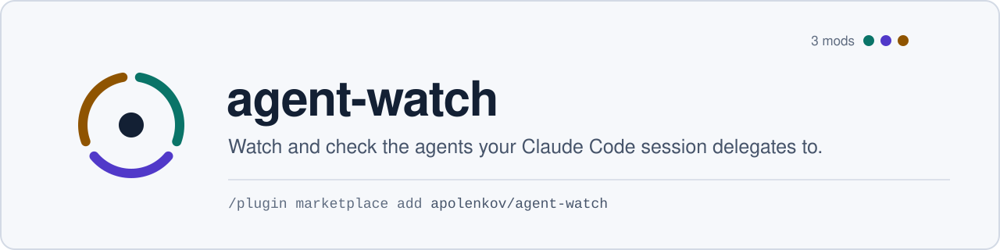

<picture>
  <source media="(prefers-color-scheme: dark)" srcset=".github/assets/banner-dark.svg">
  
</picture>

[](https://github.com/apolenkov/agent-watch/actions/workflows/ci.yml)
[](https://github.com/apolenkov/agent-watch/actions/workflows/codeql.yml)
[](LICENSE)
[](https://claude.com/claude-code)
[](https://scorecard.dev/viewer/?uri=github.com/apolenkov/agent-watch)

A showcase marketplace of [Claude Code](https://claude.com/claude-code) mods
that watch and check the agents your session delegates to. Each mod lives, is
developed and is released in its own repository; this one only lists them.

<table>
<tr>
<td width="33%" valign="top">

### [agent-shell-watch](https://github.com/apolenkov/agent-shell-watch)

**Is it still working?** Status line and `/shell-watch` pane: every Bash
call, background task and runner run (Codex, Pi, Devin, OpenCodeReview), with
liveness and a stop button.

</td>
<td width="33%" valign="top">

### [agent-council](https://github.com/apolenkov/agent-council)

**Is it actually right?** `/council` hands your working diff to every
reviewer CLI you have installed, in parallel, and merges their findings into
agreements, disagreements and unique findings.

</td>
<td width="33%" valign="top">

### [agent-compact-advisor](https://github.com/apolenkov/agent-compact-advisor)

**Is it time to compact?** A status-line score for `/compact` with reasons, a
ready `/compact` suggestion (Tab), and a template that keeps goals, decisions
and leftovers through every compaction.

</td>
</tr>
</table>


<sub>agent-shell-watch in action.</sub>

## Install

Mods are Claude Code plugins built on function hooks. You need Claude Code
**2.1.287+**, where mods are on by default.

```
/plugin marketplace add apolenkov/agent-watch
/plugin install agent-shell-watch@agent-watch
/plugin install agent-council@agent-watch
/plugin install agent-compact-advisor@agent-watch
```

| Mod                                                                         | Needs                                                                      |
| --------------------------------------------------------------------------- | -------------------------------------------------------------------------- |
| [agent-shell-watch](https://github.com/apolenkov/agent-shell-watch)         | nothing else                                                               |
| [agent-council](https://github.com/apolenkov/agent-council)                 | at least two of `codex`, `pi`, `devin`, `ocr`; Jev summary: a TypeSafe key |
| [agent-compact-advisor](https://github.com/apolenkov/agent-compact-advisor) | nothing else; optional local Kev on 127.0.0.1 for the "task done" signal   |

Options are listed in each mod's README and appear in `/config`. Each mod's
repository is also a marketplace of its own, e.g.
`/plugin marketplace add apolenkov/agent-shell-watch`.

> [!NOTE]
> **Renamed on 2026-10-04.** The marketplace `claude-mods` is now
> `agent-watch`, `shell-flow` is `agent-shell-watch` (command `/shell-watch`)
> and `council` is `agent-council` (command still `/council`); reinstall under
> the new names.

## Privacy

No telemetry. agent-shell-watch makes no network calls. agent-council sends
your diff only to the reviewer CLIs you installed (each to its own provider)
and, if you choose the Jev summarizer, the findings to TypeSafe (or to a local
System One server such as Kev on 127.0.0.1, which keeps them on your
machine); secret-like untracked files are never read. agent-compact-advisor
talks only to a loopback Kev. Details in each mod's SECURITY.md.

## Development

Code, issues and releases: [agent-shell-watch](https://github.com/apolenkov/agent-shell-watch),
[agent-council](https://github.com/apolenkov/agent-council) (their history
before the split started here) and
[agent-compact-advisor](https://github.com/apolenkov/agent-compact-advisor).
This repository checks only its listing: `npm ci && npm run check` (prettier,
`claude plugin validate --strict .`). See [CONTRIBUTING.md](CONTRIBUTING.md)
and [SUPPORT.md](SUPPORT.md).

## License

[MIT](LICENSE).
